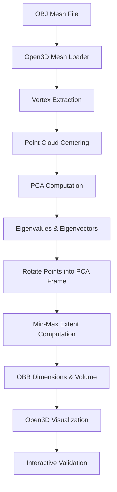

# **3D-Mesh-Measurement-System**

A Python-based 3D geometry system that reads raw `.obj` mesh files, extracts vertex data, applies **Principal Component Analysis (PCA)** to determine object orientation, computes a **tight Oriented Bounding Box (OBB)**, and visually validates dimensions and volume using **Open3D**.


---

# **Table of Contents**

1. [Overview](#overview)
2. [Features](#features)
3. [Folder Structure](#folder-structure)
4. [How to Run Locally](#how-to-run-locally)
5. [System Flow & Design Decisions](#system-flow--design-decisions)

   * Mermaid Flow Diagram
6. [Geometry Processing Pipeline](#geometry-processing-pipeline)
7. [Visualization & Validation Strategy](#visualization--validation-strategy)
8. [Challenges & Trade-Offs](#challenges--trade-offs)
9. [Performance & System Notes](#performance--system-notes)
10. [Improvements (Prioritized)](#improvements-prioritized)

---

# **Overview**

This project implements an **end-to-end 3D object measurement pipeline** designed to compute accurate dimensions of raw 3D mesh objects.

The system:

* Reads `.obj` mesh files
* Converts mesh geometry into a vertex-based point cloud
* Applies **PCA** to identify the object’s natural orientation
* Computes a **tight Oriented Bounding Box (OBB)**
* Outputs **length, width, height, and volume**
* Visually validates correctness through interactive 3D rendering

The approach reflects real-world workflows used in **3D scanning, CAD inspection, robotics preprocessing, and packaging optimization systems**.

---

# **Features**

* Raw `.obj` mesh ingestion
* Vertex-based point cloud processing
* PCA-based orientation estimation
* Tight OBB dimension and volume computation
* Interactive 3D visualization using Open3D
* Deterministic, CPU-only geometry pipeline

---

# **Folder Structure**

```
part1/
│
├── data/
│   └── .obj files
│
├── main.py
└── README.md
```

---

# **How to Run Locally**

### **1. Create Virtual Environment**

```bash
python3 -m venv venv
source venv/bin/activate
```

### **2. Install Dependencies**

```bash
pip install numpy open3d
```

### **3. Run the Program**

```bash
python3 main.py
```

---

# **System Flow & Design Decisions**

The system follows a **linear geometry-processing flow**, where each stage feeds directly into the next.

---

## **Mermaid Flow Diagram**



---

# **Geometry Processing Pipeline**

### **1. Mesh Ingestion**

* `.obj` file is loaded using Open3D
* Mesh vertices are extracted for geometric processing

### **2. Point Cloud Centering**

* Centroid of all vertices is computed
* Point cloud is centered to ensure PCA stability

### **3. PCA Orientation Estimation**

* Covariance matrix is computed from centered points
* Eigen decomposition yields principal axes
* Eigenvectors define object orientation

### **4. Oriented Bounding Box Computation**

* Points are rotated into PCA-aligned frame
* Min–max extents are computed
* Dimensions (L × W × H) and volume are calculated

---

# **Visualization & Validation Strategy**

Visualization is treated as **proof of correctness**, not decoration.

* Original mesh rendered in **gray**
* Oriented Bounding Box rendered in **red**
* Interactive camera rotation validates:

  * Correct PCA orientation
  * Tight bounding box fit
  * Absence of axis-aligned bias

This step acts as a **visual unit test** for the geometry pipeline.

---

# **Challenges & Trade-Offs**

### **1. Orientation Ambiguity**

* Raw meshes may be arbitrarily rotated
* PCA ensures deterministic orientation handling

### **2. Bounding Box vs True Volume**

* System computes **bounding box volume**, not exact mesh volume
* Chosen to match industrial packaging and inspection use-cases

### **3. Visualization Backend**

* Open3D relies on OpenGL/X11
* Wayland sessions may require Xorg fallback

---

# **Performance & System Notes**

* CPU-only computation (no CUDA/GPU dependency)
* PCA operates on a 3×3 covariance matrix
* Suitable for low-resource systems
* Scales linearly with vertex count

---
